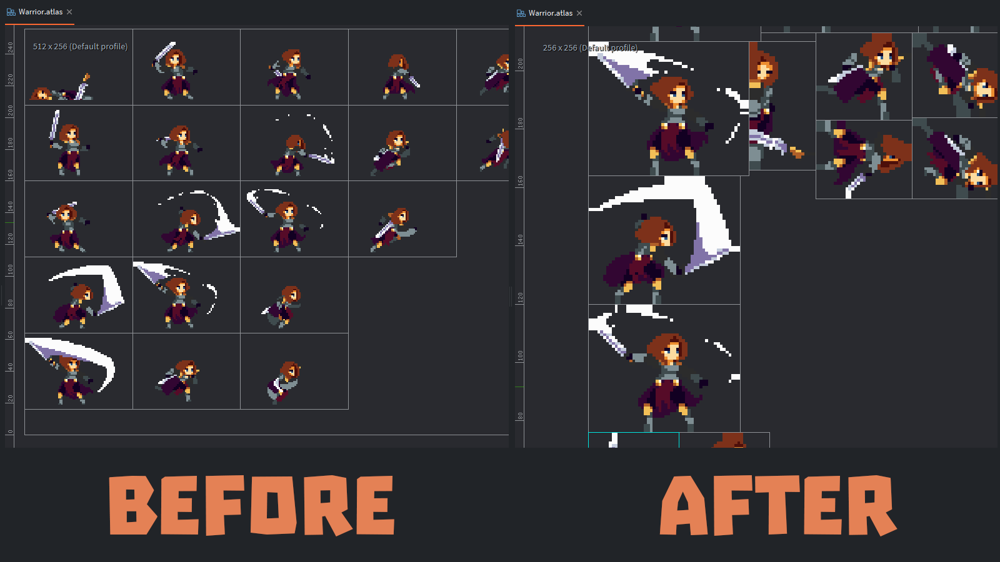

# Trim Atlas

Currently, the Defold engine does not know how to trim sprites. Its *trimming* reduces the size of the sprite geometry, but the space occupied in the texture atlas remains the same. Since version 1.9.8, Defold now supports *pivot points* for sprites inside the atlas, which makes it possible to implement *correct* trimming for them. Here is an example of how this script works:

## Dependencies

* Python 3.5 and higher + PIP:
  * `> python -m pip install --upgrade pip`
* [DefTree Library](https://deftree.readthedocs.io/en/latest/):
  * `> python -m pip install --upgrade deftree`
* [Pillow Library](https://pypi.org/project/pillow/):
  * `> python -m pip install --upgrade Pillow`

## How to use this script

* Install all necessary dependencies
* Copy the script [trim_atlas.py](trim_atlas.py) into the project folder. That is, it should be either next to the `game.project` file or in one of its subfolders.
* Run the script, passing the name of the atlas as a parameter. For example:
  * `> python trim_atlas.py assets/images/example.atlas`
* If you add the `-b` option, the script will create the original bak-copy for each modified file.

In the atlas, the script will only change the values of the `pivot_x` and `pivot_y` attributes. All other parameters remain unchanged.