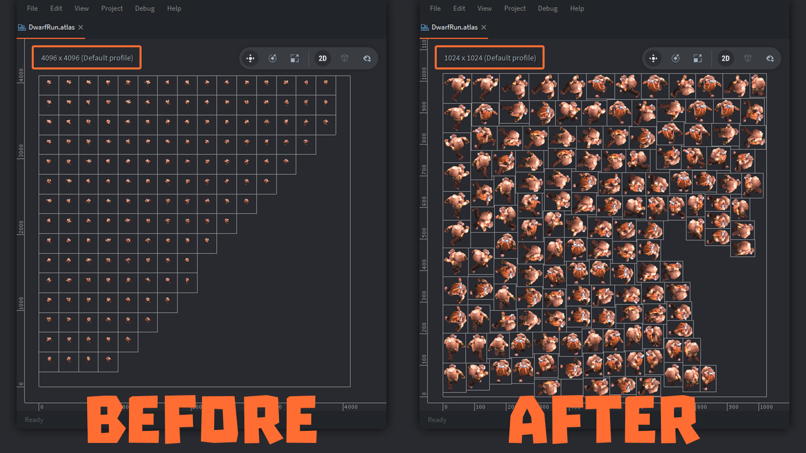

# trim_atlas.py

На данный момент движок Defold не умеет в тримминг (отсечение пустых областей) у спрайтов. Его *тримминг* уменьшает размер геометрии спрайта, но занимаемое место в атласе текстуры остается прежним. Начиная с версии 1.9.8 в Defold’е появилась поддержка *pivot points* у спрайтов внутри атласа, что дало возможность реализовать для них *правильный* тримминг. Пример работы этого скрипта:



## Зависимости

* Python 3.5 и выше + PIP:
  * `> python -m pip install --upgrade pip`
* [Библиотека DefTree](https://deftree.readthedocs.io/en/latest/):
  * `> python -m pip install --upgrade deftree`
* [Библиотка Pillow](https://pypi.org/project/pillow/):
  * `> python -m pip install --upgrade Pillow`

## Как использовать скрипт

* Установить все необходимые зависимости
* Убедится, что файл атласа лежит в папке с проектом. Т.е. он должен лежать либо рядом с файлом `game.project`, либо в одной из вложенных папок.
* Запустить скрипт, указав в качестве параметра имя атласа. Например:
  * `> python trim_atlas.py assets/images/example.atlas`
* Если добавить опцию `-b`, то для каждого изменённого файла скрипт создаст его исходную bak-копию.

В атласе скрипт изменит только значения у атрибутов `pivot_x` и `pivot_y`. Все остальные параметры останутся неизменными.

# make_atlas.py

Этот скрипт автоматически создает атлас изображений для проектов на движке Defold из упорядоченной структуры файлов изображений и папок. В качестве параметра указывается имя корневой папки, на базе которой и будет создан атлас. Имя для атласа – это имя папки, плюс расширение atlas. Структура папок должна выглядеть так *(естественно, имена файлов и папок могут быть произвольными)*:
```
root/
  animation1/           - анимация с именем animation1
    anim1_image1.png    - кадры для анимации animation1
    ...
    anim1_imageN.png
  animation2/           - анимация с именем animation2
    anim2_image1.png    - кадры для анимации animation2
    ...
    anim2_imageN.png
  ...
  image1.png            - отдельное изображение image1
  ...
  imageN.png
```

## Зависимости

* Python 3.5 и выше.

## Как использовать скрипт

* Убедится, что корневая папка атласа лежит в папке с проектом. Т.е. она должна лежать либо рядом с файлом `game.project`, либо в одной из вложенных папок.
* Запустить скрипт, указав в качестве параметра имя этой папки. Например:
  * `> python make_atlas.py assets/root`
* Сгенерированный файл атласа появится рядом с этой папкой. Для примера выше это будет файл: `assets/root.atlas`.
